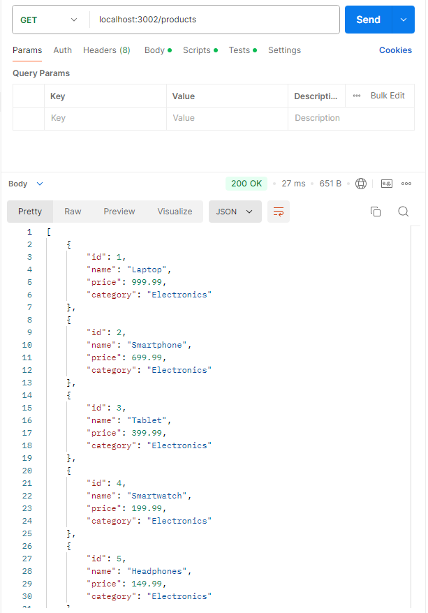
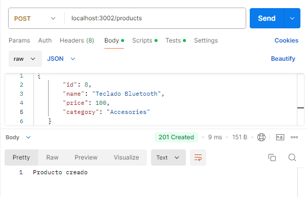
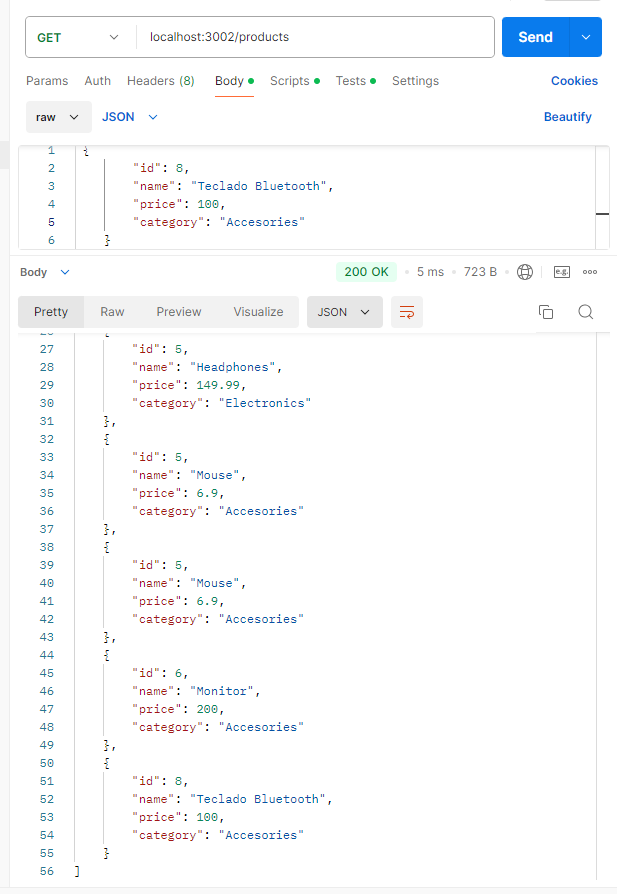
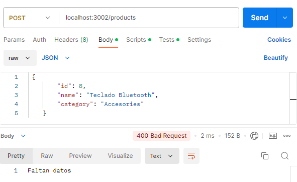

# Products API

Esta es una API simple para gestionar productos. Permite obtener la lista de productos y agregar nuevos productos.

## Requisitos

- Node.js
- npm (Node Package Manager)

## Instalación

1. Clona el repositorio o descarga los archivos.
2. Navega al directorio del proyecto.
3. Instala las dependencias necesarias (si las hubiera).

```bash
    npm install
```
## Uso

1. Asegúrate de tener un archivo products.json en el mismo directorio que index.js con el siguiente contenido inicial:

```JSON
    [
        { "id": 1, "name": "Laptop", "price": 999.99, "category": "Electronics" },
        { "id": 2, "name": "Smartphone", "price": 699.99, "category": "Electronics" },
        { "id": 3, "name": "Tablet", "price": 399.99, "category": "Electronics" },
        { "id": 4, "name": "Smartwatch", "price": 199.99, "category": "Electronics" },
        { "id": 5, "name": "Headphones", "price": 149.99, "category": "Electronics" }
    ]
```

2. Inicia el servidor:
```bash
    npm run dev
```
3. El servidor estará corriendo en http://localhost:3002

## Endpoints

### Obtener todos los productos
- URL: /products
- Método: GET
- Respuesta exitosa:
    - Código: 200
    - Contenido: Lista de productos en formato JSON.
- Referencia


### Agregar un nuevo producto
- URL: /products
- Método: POST
- Cuerpo de la solicitud:

```json
        {
        "id": 6,
        "name": "Nuevo Producto",
        "price": 99.99,
        "category": "Electronics"
    }
```
- Referencia
    - POST 
    
    - Get All
    

- Respuesta exitosa:
    - Código: 201
    - Contenido: Producto creado

- Errores:
    - Código: 400
    - Contenido: Faltan datos
    - Referencia
        