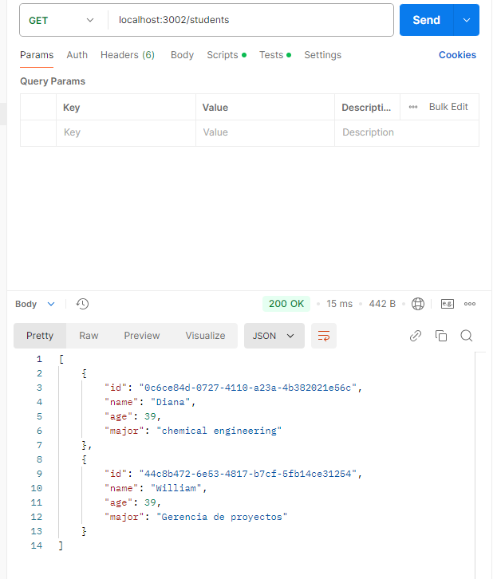
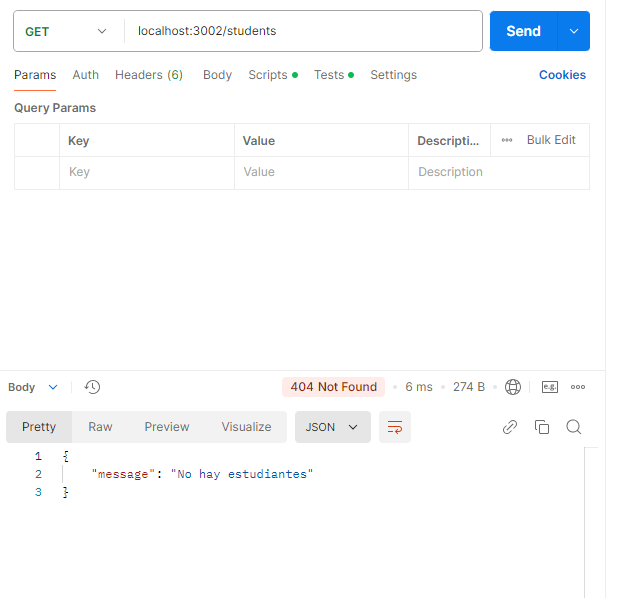
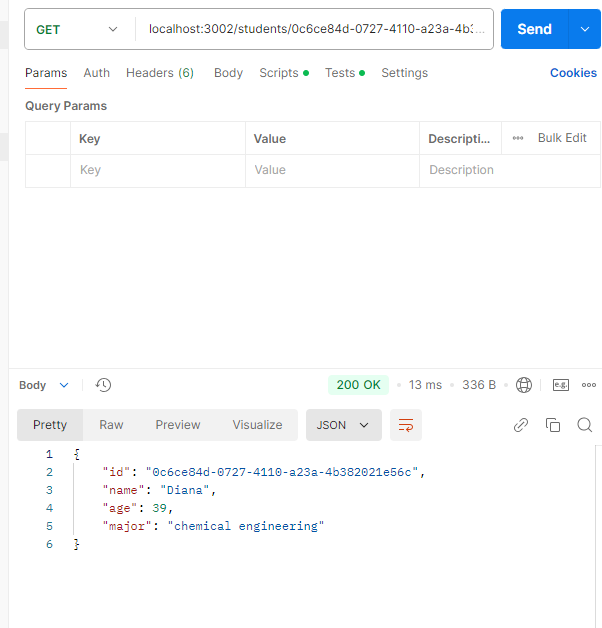
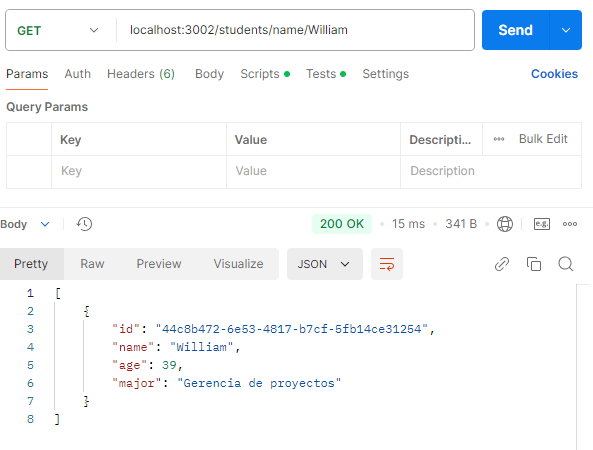
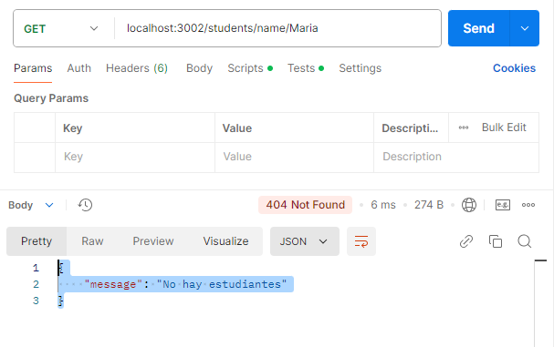
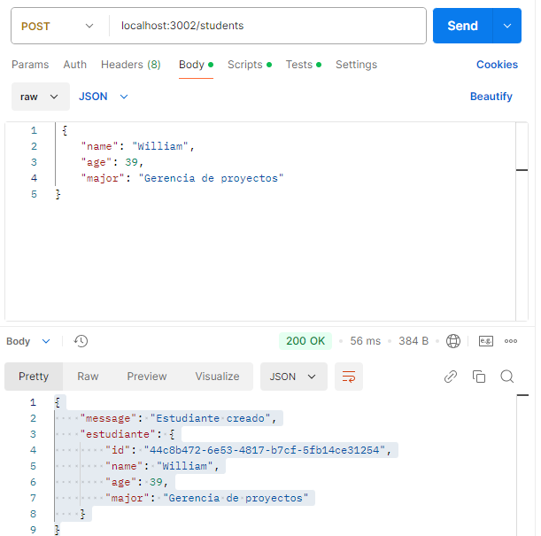
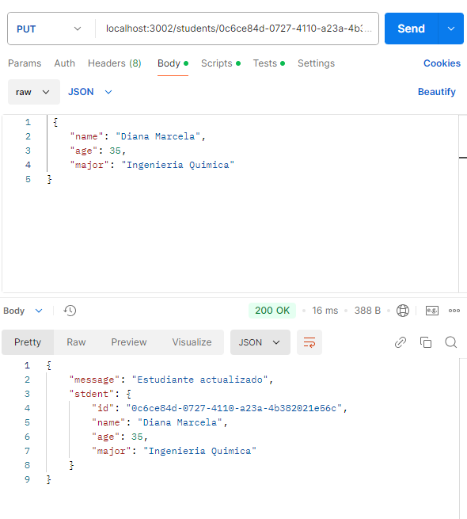
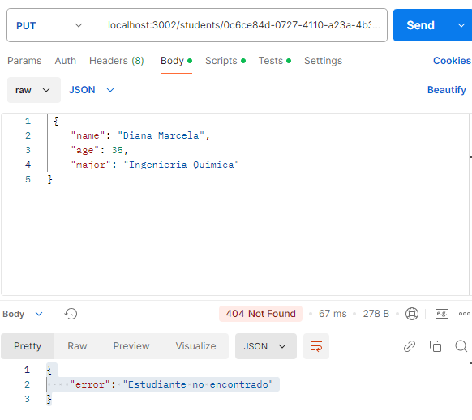
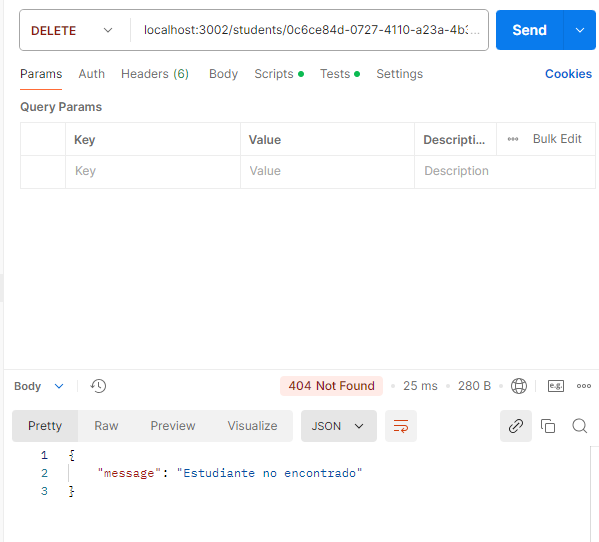

# API REST de Gestión de Estudiantes

API REST simple para gestionar información de estudiantes, desarrollada con Node.js y Express.

## Licencia

ISC

## Autor

William Saldarriaga

## Características

- CRUD completo de estudiantes
- Generación automática de IDs únicos
- Persistencia de datos en archivo JSON
- Búsqueda por ID y nombre
- Autenticación mediante token para operaciones de escritura
- Validaciones de datos de entrada

## Requisitos Previos

- Node.js (v14 o superior)
- npm

## Instalación

1. Clona el repositorio:
```bash
git clone https://github.com/tu-usuario/api-estudiantes.git
```

2. Instala las dependencias:

```bash
cd api-estudiantes
npm install
```

3. Crea un archivo `.env` en la raíz del proyecto:

```bash
PORT=3002
AUTH_TOKEN=tu_token_de_autenticacion
```

## Uso

### Iniciar el servidor en desarrollo:
```bash
npm run dev
```

## Estructura del Proyecto

```
.
├── index.js
├── funciones/
│   ├── getFunctions.js
│   ├── postFunctions.js
│   ├── putFunctions.js
│   └── deleteFunctions.js
├── middlewares/
│   └── middlewares.js
├── students.json
├── package.json
└── .env
```

## Endpoints

| Método | Ruta | Descripción | Autenticación Requerida |
|--------|------|-------------|------------------------|
| GET | / | Test del servidor | No |
| GET | /students | Lista todos los estudiantes | No |
| GET | /students/:id | Obtiene estudiante por ID | No |
| GET | /students/name/:name | Busca estudiantes por nombre | No |
| POST | /students | Crea nuevo estudiante | Sí |
| PUT | /students/:id | Actualiza estudiante | Sí |
| DELETE | /students/:id | Elimina estudiante | Sí |

## Autenticación

Para los endpoints que requieren autenticación, se debe incluir el token en el header de la petición:

```bash
Authorization: tu_token_de_autenticacion
```

#### Campos Requeridos
- Todos los campos son obligatorios (`name`, `age`, `major`)
- Se retorna error 400 si falta algún campo

#### Validación del Nombre
- El campo `name` no puede estar vacío o contener solo espacios
- Se retorna error 400 si el nombre es inválido

#### Validación de la Edad
- Debe ser un número entero positivo
- No se aceptan números decimales
- No se aceptan valores negativos
- Se retorna error 400 si la edad no cumple con estos criterios

## Ejemplo de Objeto Estudiante
```json
{
    "id": "0c6ce84d-0727-4110-a23a-4b382021e56c",
    "name": "Maria",
    "age": 25,
    "major": "computer science"
}
```
### Ejemplos de peticiones (Postman)

---

#### GET /students
### Respuesta Exitosa

```
[
    {
        "id": "0c6ce84d-0727-4110-a23a-4b382021e56c",
        "name": "Diana",
        "age": 39,
        "major": "chemical engineering"
    },
    {
        "id": "44c8b472-6e53-4817-b7cf-5fb14ce31254",
        "name": "William",
        "age": 39,
        "major": "Gerencia de proyectos"
    }
]
```


### Respuesta de Error

```
{
    "message": "No hay estudiantes"
}
```


---

#### GET /students/:id
### Respuesta Exitosa

```
{
    "id": "0c6ce84d-0727-4110-a23a-4b382021e56c",
    "name": "Diana",
    "age": 39,
    "major": "chemical engineering"
}

```


### Respuesta de Error

```
{
    "message": "No hay estudiantes"
}
```


---

#### GET /student/name/:name

### Respuesta Exitosa

### Estructura de un estudiante:
```json
{
    "id": "44c8b472-6e53-4817-b7cf-5fb14ce31254",
    "name": "William",
    "age": 39,
    "major": "Gerencia de proyectos"
}
```


### Respuesta de Error

```
{
    "message": "No hay estudiantes"
}
```


---


#### POST /students
### Respuesta Exitosa

```
{
    "message": "Estudiante creado",
    "estudiante": {
        "id": "44c8b472-6e53-4817-b7cf-5fb14ce31254",
        "name": "William",
        "age": 39,
        "major": "Gerencia de proyectos"
    }
}

```


### Respuesta de Error

```
{
    "message": "No hay estudiantes"
}
```


---


#### PUT /students/:id


### Respuesta Exitosa

```
{
    "message": "Estudiante actualizado",
    "stdent": {
        "id": "0c6ce84d-0727-4110-a23a-4b382021e56c",
        "name": "Diana Marcela",
        "age": 35,
        "major": "Ingenieria Quimica"
    }
}

```


### Respuesta de Error

```
{
    "error": "Estudiante no encontrado"
}
```


---

#### DELETE /students/:id


### Respuesta Exitosa

```
{
    "message": "Estudiante eliminado",
    "estudiante": {
        "id": "0c6ce84d-0727-4110-a23a-4b382021e56c"
    }
}

```


### Respuesta de Error

```
{
    "message": "Estudiante no encontrado"
}
```


---


## Dependencias

- express: ^4.21.1
- dotenv: ^16.4.5
- uuid: ^11.0.3

## Scripts Disponibles

- `npm start`: Inicia el servidor
- `npm run dev`: Inicia el servidor en modo desarrollo con recarga automática

